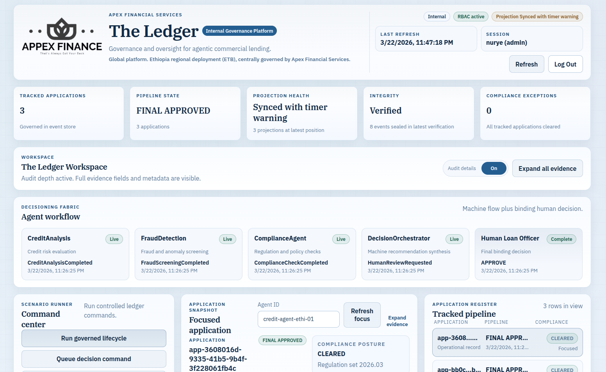
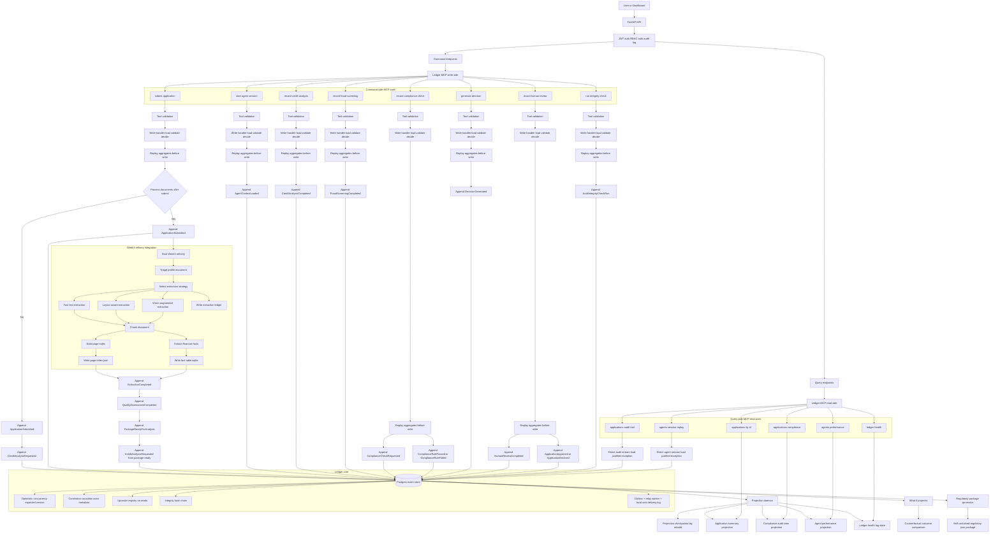

# Ledger Agentic Event Store

Production-style implementation of **The Ledger**.

This repository implements the challenge end-to-end across:
- Event store core (PostgreSQL + optimistic concurrency)
- Domain aggregates and command handlers
- Projections + async projection daemon
- Upcasting, integrity hash chain, and Gas Town recovery
- MCP tools/resources surface
- Bonus what-if projection and regulatory package generation
- Phase 7 production surface: FastAPI + React operations dashboard

## Implementation Status

All code phases are implemented:
- Phase 0: `DOMAIN_NOTES.md`, `DESIGN.md`
- Phase 1: schema + event store core + concurrency test
- Phase 2: aggregates + command handlers
- Phase 3: projections + daemon + lag + rebuild
- Phase 4: upcasting + integrity + Gas Town recovery
- Phase 5: MCP tools/resources + lifecycle test
- Phase 6: what-if projector + regulatory package
- Phase 7: API service + dashboard UI for interactive operations
- Phase 7.1: JWT auth + RBAC + auth audit trail + role-aware dashboard
- Phase 7.2: hardening updates (seed-user compatibility, Gemini opt-out fix, stale dashboard focus auto-recovery)

Current integration validation:
- `27 passed` (full suite with database running)

## Dashboard Preview



## Architecture Diagram



## Tech Stack

- Python 3.11+
- PostgreSQL 16 (project-local instance scripts included)
- `uv` for dependency and environment management
- Backend: `asyncpg`, `pydantic`, `fastapi`, `uvicorn`
- Frontend: React + TypeScript + Vite
- Testing: `pytest`, `pytest-asyncio`

## Repository Layout

```text
apps/
  api/
  web/
src/
  event_store.py
  schema.sql
  models/
  aggregates/
  commands/
  projections/
  upcasting/
  integrity/
  mcp/
  what_if/
  regulatory/
tests/
  test_api_auth.py
  test_api_surface.py
  test_concurrency.py
  test_phase2_aggregates.py
  test_projections.py
  test_upcasting.py
  test_integrity.py
  test_gas_town.py
  test_mcp_lifecycle.py
  test_what_if.py
  test_regulatory_package.py
migrations/
scripts/
```

## Outbox End-to-End (Broker-Free)

The project now includes a full outbox relay loop without requiring Kafka/Redis/Rabbit:

- Writes append to `events` and `outbox` in one transaction (`EventStore.append`).
- `scripts/run_outbox_relay.py` runs a separate relay process.
- Relay claims pending outbox rows, publishes to `outbox_sink_events`, retries with backoff, and dead-letters after max attempts.

Run one relay batch:

```bash
make outbox-relay ARGS="--once"
```

Run continuously:

```bash
make outbox-relay
```

## Week 3 Refinery Integration

This repo now includes a full local **Document Intelligence Refinery** pipeline under `src/refinery/`:

- Triage agent (`DocumentProfile` generation)
- Multi-strategy extraction (`fast_text`, `layout_aware`, `vision_augmented`) with confidence-gated escalation
- Strategy B (`layout_aware`) uses Docling when available, with local fallback when Docling is not installed
- Extraction ledger output at `.refinery/extraction_ledger.jsonl`
- Semantic chunking and chunk validation rules
- PageIndex generation at `.refinery/pageindex/{document_id}.json`
- Structured financial fact extraction into SQLite (`.refinery/facts.db`)
- Query interface methods: `pageindex_navigate`, `semantic_search`, `structured_query`

Run refinery on a document:

```bash
python scripts/run_refinery.py /path/to/document.pdf
```

Enable Gemini-backed vision calibration (optional):

```bash
GEMINI_API_KEY=your_key_here python scripts/run_refinery.py /path/to/document.pdf
```

or:

```bash
python scripts/run_refinery.py /path/to/document.pdf --gemini-api-key your_key_here --gemini-model gemini-2.0-flash
```

When `GEMINI_API_KEY` is not set (or if Gemini is unreachable), the pipeline falls back to deterministic local extraction.

integration entry point (compatible with support doc import style):

```python
from document_refinery.pipeline import extract_financial_facts

facts = extract_financial_facts("/path/to/document.pdf")
```

MCP/API integration:

- `submit_application` accepts optional fields:
- `document_path` (local file path)
- `process_documents_after_submit` (`true`/`false`)
- When enabled, submit flow will:
- run refinery extraction
- append `docpkg-{application_id}` events (`ExtractionCompleted`, `QualityAssessmentCompleted`, `PackageReadyForAnalysis`)
- append `CreditAnalysisRequested` on `loan-{application_id}` after package readiness

Configurable thresholds live in:

```text
rubric/extraction_rules.yaml
```

## Prerequisites

- Python 3.11+
- `uv` installed
- PostgreSQL binaries available at `/usr/lib/postgresql/16/bin`

## Quick Start (Recommended: Project-Local DB)

1. Install dependencies:
```bash
uv sync --dev
```
or
```bash
make setup
```

2. Start the project-local PostgreSQL instance:
```bash
bash scripts/db-start.sh
bash scripts/db-status.sh
```
or
```bash
make db-start
make db-status
```

3. Ensure `.env` is present.

If missing, create one:
```bash
cp .env.example .env
```

Example values for local project DB:
```env
PGHOST=localhost
PGPORT=55432
PGUSER=postgres
PGPASSWORD=
PGDATABASE=ledger_event_store
DATABASE_URL=postgresql://postgres@localhost:55432/ledger_event_store
```

4. Apply migrations:
```bash
bash scripts/migrate.sh
```
or
```bash
make migrate
```

5. Start API service:
```bash
bash scripts/api-start.sh
```
or
```bash
make api
```

6. Run tests:
```bash
DATABASE_URL=postgresql://postgres@localhost:55432/ledger_event_store .venv/bin/pytest -q
```
or
```bash
make test
```

7. Stop local DB when done:
```bash
bash scripts/db-stop.sh
```
or
```bash
make db-stop
```

## End-to-End Verification Runbook

This is the recommended challenge proof flow from a clean shell.

1. Setup and local database:
```bash
make setup
make db-start
make migrate
```

2. Run full automated verification:
```bash
DATABASE_URL=postgresql://postgres@localhost:55432/ledger_event_store .venv/bin/pytest -q -rs
```

Expected signal:
- `27 passed`
- no `FAILED` lines

3. Start API (terminal A):
```bash
make api
```

4. Run live lifecycle + projection proof (terminal B):
```bash
set -euo pipefail
BASE="http://127.0.0.1:8000/api/v1"

TOKEN="$(
  curl -sS -X POST "$BASE/auth/login" \
    -H 'content-type: application/json' \
    -d '{"username":"melat","password":"melat@123"}' \
  | jq -er '.result.access_token'
)"

BOOT="$(
  curl -sS -X POST "$BASE/bootstrap/demo" \
    -H "authorization: Bearer $TOKEN" \
    -H 'content-type: application/json' \
    -d '{}'
)"

APP_ID="$(echo "$BOOT" | jq -er '.result.application_id')"
STATE="$(curl -sS "$BASE/applications/$APP_ID" -H "authorization: Bearer $TOKEN" | jq -er '.result.current_state')"
COMP="$(curl -sS "$BASE/applications/$APP_ID/compliance" -H "authorization: Bearer $TOKEN" | jq -er '.result.snapshot.compliance_status')"
COUNT="$(curl -sS "$BASE/events/recent?limit=10" -H "authorization: Bearer $TOKEN" | jq -er '.result.count')"
METRIC="$(curl -sS "$BASE/metrics" -H "authorization: Bearer $TOKEN" | rg '^ledger_projection_events_behind')"

echo "application_id: $APP_ID"
echo "state: $STATE"
echo "compliance: $COMP"
echo "recent_events_count: $COUNT"
echo "$METRIC"

test "$STATE" = "FINAL_APPROVED"
test "$COMP" = "CLEARED"
test "$COUNT" -gt 0
echo "DEMO PASS"
```

Expected signal:
- `state: FINAL_APPROVED`
- `compliance: CLEARED`
- `recent_events_count` greater than `0`
- `ledger_projection_events_behind{...} 0` for projections
- final line `DEMO PASS`

5. Optional dashboard run:
```bash
make web-install
make web
```
Open `http://localhost:5173`.

## Phase 7: API + Dashboard

### Backend API

- Entry module: `apps/api/main.py`
- Start command: `bash scripts/api-start.sh`
- Default base URL: `http://127.0.0.1:8000/api/v1`

Important routes:
- `POST /auth/login`, `GET /auth/me`, `GET /auth/audit`
- `GET /health`
- `POST /commands/{tool_name}` (all 8 tool commands)
- `POST /bootstrap/demo` (creates full end-to-end demo lifecycle)
- `GET /applications`, `GET /applications/{id}`
- `GET /applications/{id}/compliance`
- `GET /agents/{id}/performance`
- `GET /ledger/health`
- `GET /events/recent`
- `GET /metrics` (Prometheus-style text)
- `GET /stream/lag` (SSE lag stream)

API env knobs:
```env
DATABASE_URL=postgresql://postgres@localhost:55432/ledger_event_store
API_HOST=127.0.0.1
API_PORT=8000
API_CORS_ORIGINS=http://localhost:5173,http://127.0.0.1:5173,http://0.0.0.0:5173,http://[::1]:5173
API_APPLY_SCHEMA_ON_START=true
# LEDGER_API_KEY=optional-api-key
GEMINI_API_KEY=optional-gemini-key
GEMINI_MODEL=gemini-2.0-flash
JWT_SECRET=replace-with-long-random-secret
JWT_ISSUER=ledger-api
JWT_TTL_MINUTES=120
SEED_DEMO_USERS=true
LEDGER_ANALYST_ONE_USERNAME=melat
LEDGER_ANALYST_ONE_PASSWORD=melat@123
LEDGER_ANALYST_TWO_USERNAME=kedir
LEDGER_ANALYST_TWO_PASSWORD=kedir@123
LEDGER_ADMIN_USERNAME=nurye
LEDGER_ADMIN_PASSWORD=nurye@123
```

If your dashboard is opened via LAN IP (example `http://10.69.158.161:5173`), add that origin to
`API_CORS_ORIGINS` in `.env` and restart API.

Default seeded users when `SEED_DEMO_USERS=true`:
- `analyst / analyst123!` (analyst, compatibility user)
- `compliance / compliance123!` (compliance, compatibility user)
- `ops / ops123!` (ops, compatibility user)
- `admin / admin123!` (admin, compatibility user)
- `melat / melat@123` (analyst)
- `kedir / kedir@123` (analyst)
- `nurye / nurye@123` (admin)

Other users are marked inactive by default at startup. You can change demo credentials with:
- `LEDGER_ANALYST_ONE_USERNAME`, `LEDGER_ANALYST_ONE_PASSWORD`
- `LEDGER_ANALYST_TWO_USERNAME`, `LEDGER_ANALYST_TWO_PASSWORD`
- `LEDGER_ADMIN_USERNAME`, `LEDGER_ADMIN_PASSWORD`

Role policy highlights:
- `analyst`: standard write operations for case progression
- `admin`: full access including integrity verification, audit log access, and projection rebuild

If needed, you can manually provision additional roles directly in `auth_users`.

### React Dashboard

1. Install dashboard deps:
```bash
cd apps/web
npm install
```
or from repo root:
```bash
make web-install
```

2. Optional env:
```bash
cp .env.example .env
```

3. Start dashboard:
```bash
cd ../..
bash scripts/dashboard-start.sh
```
or from repo root:
```bash
make web
```

4. Open:
- `http://localhost:5173`

The dashboard provides:
- Login/logout screen with JWT session
- Role-based tool visibility
- Compliance/admin-only auth audit panel
- One-click demo scenario generation
- Command console for tool invocation
- Application/compliance views
- Agent performance view
- Projection lag and recent event feed

## pgAdmin Connection

If you want to inspect tables in pgAdmin, use:
- Host: `127.0.0.1`
- Port: `55432`
- Username: `postgres`
- Password: your configured postgres password
- Database: `ledger_event_store`

If pgAdmin points to `5432`, it will fail unless a separate system PostgreSQL is running there.

## Migration Flow

- Migration files live in `migrations/` and are applied in filename order.
- `src/schema.sql` is the canonical latest schema snapshot.
- Migrations are idempotent (`IF NOT EXISTS`) and can be re-run safely.

Run migrations:
```bash
bash scripts/migrate.sh
```

## MCP Surface

The MCP layer is implemented in `src/mcp/` as an in-process server interface:
- Tools (command side): 8
- Resources (query side): 6
- Structured typed errors with `suggested_action`
- Lifecycle covered by `tests/test_mcp_lifecycle.py`

### Minimal usage example

```python
import asyncio
from src.event_store import EventStore
from src.mcp.server import LedgerMCPServer

async def main():
    store = await EventStore.from_dsn("postgresql://postgres@localhost:55432/ledger_event_store")
    server = LedgerMCPServer(store=store, auto_project=True)
    await server.initialize()

    result = await server.call_tool(
        "submit_application",
        {
            "application_id": "app-123",
            "applicant_id": "customer-1",
            "requested_amount_usd": 10000,
            "loan_purpose": "equipment",
            "submission_channel": "portal",
            "submitted_at": "2026-03-17T12:00:00+00:00",
        },
    )
    print(result)
    await store.close()

asyncio.run(main())
```

## Testing

Run everything:
```bash
DATABASE_URL=postgresql://postgres@localhost:55432/ledger_event_store .venv/bin/pytest -q -rs
```

Run key integration slices:
```bash
.venv/bin/pytest -q tests/test_api_auth.py
.venv/bin/pytest -q tests/test_api_surface.py
.venv/bin/pytest -q tests/test_concurrency.py
.venv/bin/pytest -q tests/test_projections.py
.venv/bin/pytest -q tests/test_mcp_lifecycle.py
.venv/bin/pytest -q tests/test_what_if.py tests/test_regulatory_package.py
```

## Troubleshooting

### `db-start` says another server might already be running

Check status first:
```bash
bash scripts/db-status.sh
```

If status says `accepting connections`, you can continue.

### Connection refused on `127.0.0.1:5432`

This project-local DB runs on `55432`, not `5432`.
Update your connection string/pgAdmin server accordingly.

### Tests are skipped

Integration tests skip when `DATABASE_URL` is missing or PostgreSQL is unreachable.
Set `DATABASE_URL` and start DB first.

## Notes

- Root-level `models/` is an unused scaffold folder; active models are in `src/models/`.
- Local DB data and runtime files are ignored via `.gitignore` under `.local/postgres/`.

## Shutdown

When finishing:

1. Stop the API process (`Ctrl+C`) in its terminal.
2. Stop the dashboard dev server (`Ctrl+C`) if running.
3. Stop project-local PostgreSQL:
```bash
make db-stop
```
